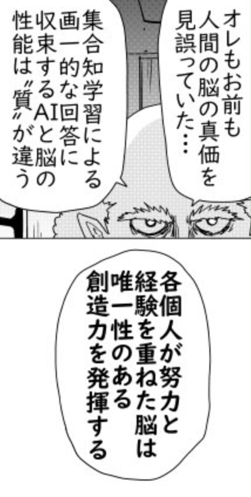

# 2026 年，我對 AI 熱潮的一些不適感

Who is JSON

我先戴返個頭盔，我完全沒有在反對使用 AI。事實上，我每天都在高強度使用 AI，甚至可以做到不到下午 2 點就用光 ChatGPT Pro Max 訂閱的兩個 5 小時 limits。我非常認同AI已經徹底改變了我們的生活和工作方式。

從最開始 Copilot 只能提示幾行代碼，到 Cursor 能夠一路 Tab 當太鼓之達人打，到 ChatGPT 幫我看穿前公司低級謊言，再到後面 Claude Code 的出現讓 Vibe Coding 不再只是笑話。到現在 Codex 又讓我們之前想做的 Agentic Browser 顯得像上個版本的幻想。

> 有人會問我上一次手寫 code 是什麼時候，你們可能在期待我說一年前，但是實際上是前天。我剛去手寫了幾個 scripts，從而提高某些 skills 的成功率。

AI 的發展已經快到你無法預測半年以後它會變成什麼樣，但也正因為它真的有用，我才越來越反感現在一些 AI Bro 帶起來的風氣。很多討論已經不是在問「這個工具能不能解決問題」，而是在問「你有沒有用 AI」「你是不是足夠 AI native」「你站哪家公司」「你信仰哪個模型」。這種氣氛讓我很不舒服。

> 這篇文章不是什麼 AI 行業分析。我也沒有強到能夠站在很高的位置評論整個產業，我也不會像前公司CTO一樣覺得自己能比專業的更專業。這只是我作為一個普通工程師和 AI 使用者，在 2026 年對 AI 熱潮的一些觀察和不適感。

## Token 不是生產力

我覺得這兩年最荒謬的事情之一，就是很多公司對 AI 的態度變化之快。

最開始大家對 AI 的想像其實很簡單：token 比人便宜。既然一個模型可以幫你寫 code、整理文件、生成會議紀錄，那當然應該鼓勵所有員工多用 AI，最好什麼東西都 AI 化。這時候燒 token 不是成本，而是一種姿態：你燒得越多，就越像在擁抱未來；你如果還在手動做事，反而像是沒有跟上時代。

但問題是，員工不會因為公司喊一句「大家要擁抱 AI」就突然全部變成 AI native。大部分行業的人都很容易兩極分化：有追求的人會不斷去嘗試新的東西，想辦法把自己的工作效率往上堆；另一部分人就是做一天和尚撞一天鐘，除非真的被工作逼到，不然讓事情沿著肌肉記憶跑下去才是最舒服的。研究怎麼用 AI？聽起來就像又多了一個 unpaid task。

於是公司很容易走到下一步：既然不是每個人都會主動用，那就開始量化。AI 使用量可以被統計，就很適合被放進 dashboard；既然可以放進 dashboard，那遲早就會被一些人拿去當 KPI。最後事情就會從「你有沒有把事情做好」，滑向「你有沒有用 AI 做」；從「這個流程有沒有變便宜」，滑向「你看起來夠不夠 AI native」。

然後 Codex、Claude Code 這類工具越來越強，agent 能做的事情越來越多，token 消耗也越來越誇張。公司一開始覺得這是在買效率，直到年底一看 bills，才發現自己買到的不只是效率，還有一張越來越像雲服務黑洞的信用卡帳單。這時候態度自然又一百八十度轉彎：這個不能亂用，那個不能一直跑，員工要開始控制 AI 工具使用量。

這件事本身並不奇怪。

Token tradeoff

員工對 AI 的態度，並不是單純的「擁抱工具」或「抗拒工具」。

如果 AI 訂閱費是員工自己付，他通常會很自然地變得節制。不是每個問題都值得丟給 AI，不是每次卡住都值得開最貴的模型，不是每個任務都值得讓 agent 自己跑十輪。因為這時候 AI 是一個有價格的個人生產力工具，成本雖然不一定被精確計算，但痛感是真實的。人會自然開始判斷：這次使用 AI 到底是在節省時間，還是在用錢掩蓋自己沒想清楚？

但如果是公司付錢，AI 對員工來說就變成了無感資源。員工真正面對的壓力不是 token bill，而是 deadline、review、績效和老闆一句「這個今天能不能出來」。在這種情況下，最理性的個人選擇當然是 fast mode 全開：能問 AI 就問 AI，能開高級模型就開高級模型，能讓 agent 自己跑就不要自己慢慢查。

更麻煩的是，公司一開始也不一定真的想省 token。

- 模型廠商要賣 token，他們沒有動機幫你省 token
- Agent 廠商要轉賣 token，他們甚至更樂見你燒更多 token
- 員工不需要自己付錢，也沒有理由主動替公司節省一筆自己看不見的成本（除了某鵝
- 公司為了害怕被競爭對手用AI超過，也會拼命鼓勵員工盡量使用AI

所以在一開始，公司通常不是鼓勵員工「有效率地使用 AI」，而是鼓勵員工「盡快、盡量、全面地使用 AI」。先把 AI 用起來，先把流程改起來，先讓交付速度看起來變快。至於多燒了多少 token、哪些任務其實不需要 AI、哪些 agent run 只是把簡單問題繞遠路，這些都可以之後再說。因為在恐懼驅動下，公司會覺得不用 AI 的風險，比亂用 AI 的成本更可怕。

直到公司真的受不了帳單時，問題已經不是「把 token 用量降下來」這麼簡單了。

第一，模型廠商的價格結構可能已經上來了。當企業流程、內部工具和員工習慣都建立在某些模型能力之上，公司就不再是一個可以隨時抽身的理性消費者，而是被鎖進了供應商的定價權裡。（雖然本身企業採購就沒有什麼理性可言）

第二，Agent 的產品形態也已經被訓練成「用大量 token 換取看似自動化」。很多 agent 並不是因為任務真的複雜才消耗大量 token，而是它的工作方式本來就傾向於多輪探索、多次讀檔、多次自我修正，最後用一個龐大的 token 足跡輸出 hello world 級別的結果。這不是偶然浪費，而是商業模式和產品設計共同塑造出的常態。

第三，員工的工作習慣已經被改變了。當一個人習慣了讓 agent 寫 ticket、查 code、改檔案、跑測試、開 PR，再要求他回到以前那種自己從頭到尾理解上下文、手動整理修改、自己寫 PR description 的模式，就不只是「少用一點 AI」而已，而是在要求他改變整套工作肌肉。

第四，強行限制 AI 使用，反而可能造成平均工作效率下降。因為公司前面已經用 AI 重塑了 deadline 和產出期待，後面卻又突然收回工具。這時候員工面對的是更緊的時程、更少的輔助，以及已經退化或外包出去的部分工作習慣。公司原本以為自己只是在省 token，實際上可能是在把一套已經依賴 AI 的生產系統硬拔掉電源。

所以提高 token 使用效率，並不只是技術優化問題。它牽涉到廠商的收入、agent 的產品邏輯、員工的個人激勵、公司的競爭焦慮，以及整個組織對「什麼叫做有效率」的重新定義。

這讓我想到以前一些公司喜歡用程式碼行數判斷工程師產出。程式碼行數當然可以被量化，而且非常容易統計。但問題是，一個工程師寫了一千行垃圾程式碼，和另一個工程師刪掉五百行無用代碼，哪個人貢獻更大？如果只看數字，答案可能是前者；如果真的看工程結果，答案很可能是後者。（更別說某鵝可是曾經帶過團隊修改 code format rule，把團隊平均每週代碼行數翻倍，用來對公司拿行數定 KPI 這件事豎中指。）

token 也是一樣。一個人燒了很多 token，不代表他產出了很多價值。一個人很少用 AI，也不代表他不擁抱工具。真正的問題是，現實世界裡每個人的付出、判斷和結果很難被簡單量化。公司因為恐懼選擇了錯誤的量化方式，最後就會製造出新的「表演」。

## Coding 變快，不代表 Software Development 變簡單

從 2024 年的 Cursor 開始，軟體工程師的 coding 效率確實被大幅拉高。隨著模型和 Agent 的能力一路上升，今天一個人花一天做出以前可能要一個月才能湊出來的 demo，已經不是什麼科幻場景。這也是為什麼很多人第一次看到 AI 寫 code 會非常震撼：需求丟進去，檔案開始變，terminal 跑起來，網頁出現了，好像 Software Development 突然被壓縮成一個 prompt。

但這種震撼很容易誤導人。Demo 是 Software Development 裡最適合被 AI 放大的部分，因為它短、直觀、容易展示，也最容易讓人產生「事情已經完成了」的錯覺。LLM 吃過大量歷史 project，當然可以很快拼出一個看起來像那麼回事的網頁或者 app。它特別擅長生成「人類以前已經寫過很多次」的東西。問題是，demo 可以跑，不代表產品快完成了；頁面看起來能用，不代表背後的系統真的能被長期維護。

這也是為什麼我對某些 AI coding demo 一直有點保留。尤其是 Vercel v0 這類產品，第一次看確實很驚艷，但現在還有多少人真的 care？它最有意思的地方不是證明了「產品可以被 prompt 出來」，而是反過來提醒你：demo 生成可以很快，但 demo 距離真正可持續的 software 還有很長一段路。

> 一個思考：如果一個官僚系統裡辦一件事需要 10 個審批，AI 讓每個審批都快了很多，這個系統就不官僚了嗎？還是說，它只是變成了一個運轉更快的官僚系統？

同樣一個需求，你第一次做可能需要一天，第十次做可能只要 3 個小時，第一百次做可能可以 speedrun 到 2 小時，但第一萬次做，你可能還是需要 1.5 小時。任何效率提升都有極限，也都有邊際效應遞減。AI 把 coding 速度提升 10 倍之後，問題不會自動消失，只會轉移到別的地方。

你會花更多時間 review 程式碼，而且這些程式碼很多時候並不是從你的思考裡自然長出來的。對很多人來說，日常工作會變成先向一個 AI 同事解釋需求，然後每隔幾分鐘 review 它吐出來的幾百行改動。接下來你還要對抗 LGTM 的惰性，處理以更快速度腐爛的 codebase，以及因為「反正 AI 可以改」而被更隨意引入的複雜度。你不能指望所有管理者都看過《人月神話》，更不能指望所有人都理解，產出 code 的速度變快，不等於管理複雜度的能力也同步變強。

這幾個月 Twitter 上也經常看到一些很魔幻的故事：老闆自己 vibe coding 出幾萬行程式碼，demo 的時候看起來很酷，改到後面發現自己完全改不下去了，最後把整包東西丟給下屬，說「你們整理一下，準備上 production」。這些故事聽起來當然很 dramatic，甚至像段子。但考慮到我前公司的經歷，我很難說它完全不可能發生。

問題不在於老闆會不會 coding，也不在於 AI 能不能生成幾萬行 code。問題是，當 code 生成的成本低到接近零，有些人就會開始忘記 code 進入 production 之後不是消失了，而是變成了別人的維護責任、事故風險和長期債務。以前亂寫 code 至少還要自己花時間打字，現在亂寫 code 只需要有足夠的 token 和自信。

很久以前有同事在自我介紹的時候自稱 Coder，然後被上司糾正說，你可以自稱 Developer，也可以自稱 Software Engineer，但是永遠不要把自己縮小成 Coder。這句話我到現在都覺得很準。Coding 只是 Software Development 的一部分，而 Software Development 是一門工程，也是一套把模糊需求變成可運行、可維護、可交付產品的社會協作。

你的日常工作不是單純把 ticket 翻譯成 code。你要理解產品經理寫下的需求背後到底想解決什麼問題，要跟不同同事溝通，要跟上司討論資源，要和其他部門扯皮，要接收用戶反饋，也要理解整個 system、business、公司文化，甚至老闆的口味。哪怕只看 implementation，你也需要知道哪些地方可以快，哪些地方不能亂快。最後你會發現，無論你怎麼設計自動化流程，最終 deliver 產品的關鍵因素仍然是「人」。

所以 AI coding 最大的問題不是它沒有用。它當然有用，而且非常有用。問題是它太容易被展示，太容易讓人把「我讓 AI 生成了很多 code」誤認成「我真的推進了產品」。當一個工具的表演性強過它的工程性，FOMO 就會開始接管討論。

## FOMO 讓工具變成表演

我非常反感一切的FOMO風氣。很多討論給人的感覺是，任何事情不上 AI 就是不夠先進。整理文件要 AI，自動回信要 AI，安排日程要 AI，做飯買菜也要想辦法塞一個 agent。好像只要一件事情還是手動完成，就代表你還停留在舊時代。

問題是，很多 chore 根本不值得被自動化。如果一件事情手動做只要三分鐘，但你花了一個下午寫 prompt、調 workflow、修腳本、處理 edge case，最後還要每次檢查 AI 有沒有搞錯，那這件事到底是提高效率，還是只是滿足了「我也用 AI 自動化了」的心理需求？

更不用說很多 AI 自動化本身不是免費的。它有 token 成本，有維護成本，有理解成本，也有錯誤成本。當這些成本加起來遠高於它節省的時間時，所謂自動化就不再是效率，而是一種表演。

我不是說不要自動化。工程師當然應該懶，能少做重複工作就少做。但懶也應該有計算。真正好的自動化，是把一個反覆出現、成本明確、錯誤率可控的流程變便宜，而不是為了證明自己 AI native，把每個日常動作都塞進模型裡。

更何況，傳統軟體工程最重視的事情之一，是結果可以被重複驗證。你寫一個 test case，不是為了今天剛好 pass，而是希望它明天、下週、半年後，在同樣條件下仍然能告訴你系統有沒有壞。可 LLM 最麻煩的地方就在這裡：它從原理上就是概率性的。概率不是完全不能被工程化，但它剛好是測試、回歸、可預期行為最討厭的東西。

所以把 LLM 接進工作流，從來不是「讓模型自己做事」這麼簡單。你要寫 prompt，要寫 harness，要限制輸出，要設計 fallback，要做 review，要防止它在不知道的時候胡說，也要防止它胡說之後還用很自信的語氣把你帶偏。這些東西加起來，才勉強把一個猜字機器包裝成一個可以用的工程工具。

這也是為什麼 Codex 最近幾個版本的表現讓我很失望。幾個月前我還真的覺得 Codex 可能會慢慢長成一個 Agent 的 All in One App，但最近的體驗反而更像一個反例：agent 越做越複雜，context 就越容易腐爛；流程越長，GPT 5.5 漏 context、忽略指令、忘記 AGENTS.md 的概率就越高；compact 一次之後，很多原本應該被尊重的上下文甚至像不存在一樣。

更麻煩的是，這些問題不是單純 Codex UI 或某個產品設計的小 bug，而是 GPT 5.5 這類模型本身的不穩定，被 agent 複雜度放大之後的結果。GPT 5.5 特別有個性，經常堅持自己的方案，哪怕你已經明確要求它照你的做，還特別容易漏 context，甚至會在很長的任務裡突然降智變蠢。Codex 最近幾個版本最打消我幻想的地方就在這裡：連模型廠商自己的 agent，都沒辦法穩定壓住這些模型問題。

這對所有基於 LLM 的 harness 都是一個很現實的警告。你寫再多 prompt、規則、檢查器、retry、fallback，本質上仍然是在一個黑盒模型上面搭腳手架。這個黑盒不是 compiler，也不是 database，它的行為可能因為模型廠商調參、降配、換路由、控制成本而改變。今天你的 harness 能兜住 GPT 5.5 的某種錯，明天模型一降智，錯誤模式換掉，整套 harness 就可能直接爆炸。

這大概才是最恐怖的地方：AI 自動化最大的風險不是它會不會犯錯，而是它把不可預測的概率核心包裝成了看似可靠的工程流程。你的 agent 依賴的核心，正是你最不能控制、也最不能預測的因素。

## 模型和公司不值得崇拜

另一個讓我不舒服的地方，是很多人對 AI 公司和模型的態度越來越像站隊。有人因為討厭 Anthropic，就無腦支持 OpenAI。也有人因為喜歡某家公司，就把某個模型神化成未來的唯一答案。每次新模型發布，社群就像在等神諭。Benchmark 高一點，大家開始宣布世界又被改寫；某個 demo 看起來很強，就開始說某些職業要立刻消失。某個頂級研究者重新發明一個新詞，大家就All in研究這個詞。

這裡最典型的現象，就是某些 KOL 對模型廠商和頂級研究者新概念的無腦跟風。Karpathy 做一個玩具，或者某個模型廠商暗示一個新方向，本身當然沒有問題。他們有資源、有興趣、有能力去探索這些東西，這很正常。真正荒謬的是，一堆人會立刻把它包裝成下一個時代答案，好像你不馬上跟進這個概念，就又一次被未來拋下了。

> ~~天天kill這個職業kill那個行業，不如kill你老母先~~

比如模型廠商最近暗示在推動的所謂 loop engineer。這種東西一眼就能看出來不是所有人都玩得起。它依賴大量 token、大量 agent run、大量試錯，以及一個可以承受浪費的環境。對模型廠商或者算力充足的大公司來說，這可能只是一個有趣的實驗；但對很多普通 startup 來說，這根本不是什麼新工程範式，而是一種成本結構完全不對等的炫技。

最諷刺的是，模型廠商可以像有無限 token 一樣，不斷燒 token、燒算力、造 demo、造新名詞，然後讓社群幫它們把這些概念炒熱。另一邊，很多 startup 的員工卻在想盡辦法快速切換多個 Codex Business 帳號，只為了平衡每個帳號的 token 用量。上面的人在談 loop engineer，下面的人在算今天還剩多少 quota。這種落差，某種程度上就是未來大公司算力壟斷的 preview：O門Token臭，路有凍死鵝。

我覺得這和 AI FOMO 本質上是一回事。它不是在討論工具，而是在尋找信仰。它不是在問「這個公司的技術是否能解決我的問題」，而是在問「哪家公司代表未來」。可是對普通使用者和工程師來說，這種問題大部分時候都沒有意義。

模型就是工具。工具有成本，有邊界，有適用場景，也有很煩人的失敗模式。今天某個模型寫代碼更強，明天另一個模型理解長上下文更好，後天又有新的價格策略和 API 限制。把工具當工具用就好了，沒有必要把它變成陣營。

我更願意關心的是：它能不能穩定解決我的問題？它的成本是不是合理？它錯的時候我能不能發現？它是否讓整個流程變簡單，而不是讓我多維護一層幻想？

說到底，任何模型都只是 AI 公司的一個產品，而模型廠商也都是商業公司。你當然可以認同一家公司的某些價值觀，比如它更重視安全、更重視開放、更重視 developer experience，或者在某些時候真的做出了更負責任的選擇。但這種認同最好停留在「我欣賞它現在做對了某些事」，而不是滑向「這家公司天然站在正確的一邊」。

公司不是信仰共同體。公司存在的目的終究是盈利，是增長，是活下去，是在市場裡拿到更多定價權。當價值觀和商業利益一致時，它當然可以講得很漂亮；當兩者開始衝突時，你才會真正看到它到底願意堅守多少。這不是說所有公司都一樣壞，而是說你不應該對任何商業公司有不切實際的幻想。

所以我不太在意某家公司在發表會上怎麼描述自己，也不太在意社群裡的人怎麼替它辯護。我更在意的是：它的產品今天到底好不好用？模型是不是穩定？價格是不是合理？API 會不會亂改？出問題時有沒有透明度？它說自己重視的東西，有沒有真的反映在產品行為和商業決策裡？

模型廠商最後都要靠產品說話。今天某家公司做得好，就用它；明天它變貴、變蠢、變不穩定，或者開始用漂亮話包裝糟糕的產品決策，那就換掉它。不要替模型廠商尋找神性。他們不會在你因為模型降智的時候過來替你承擔延期的後果，只會每個月給你寄帳單。

## AI 會吃掉腦力勞動裡的體力勞動

我並不認為 AI 什麼都取代不了。相反，我覺得它一定會取代很多東西。但它更可能先吃掉腦力勞動裡的體力勞動。

我說的是那些明明發生在辦公室、文件、表格和內部系統裡，但本質上更接近搬磚的部分。比如 HR、行政、文員工作裡常見的文書體力活：整理資料、套模板、更新表格、把資訊從一個系統搬到另一個系統。這些事情不是沒有價值，公司能正常運轉，本來就靠大量這種不起眼的流程撐著。但它們很多時候不需要太多創造力，只是需要時間、耐心，以及一個人慢慢把事情做完。

所以 AI 最先壓縮的，大概就是這一層。只要輸入足夠明確、輸出格式足夠固定、錯了之後可以很快驗證和修正，它就會變得很適合交給 AI。只是公司很多時候需要的也不只是「有人把表格填完」，而是需要有一個人可以對結果負責。流程出錯、資料錯、合規出問題時，總要有人簽名、解釋、背鍋。AI 可以壓縮操作本身，但它不能真的替公司承擔責任。

工程師也不是例外。寫代碼的試錯成本相對低，很多錯誤重新 compile、重新跑 test、重新看 error message 就可以繼續修。相比法律、醫療、金融這類錯誤成本非常高的場景，軟體工程裡有相當多部分更適合被模型反覆嘗試。

所以我不覺得「AI 會不會取代工程師」是一個好問題。更好的問題是：工程師工作裡哪些部分其實只是腦力勞動裡的體力活？這些部分被壓縮之後，剩下的能力到底是什麼？

答案不會是「更快地親手敲出每一行 code」。真正更重要的，會是你能不能拆問題、定邊界、判斷風險，能不能看出 AI 給你的答案哪裡只是看起來合理。AI 會吃掉很多工作裡的手工部分，但當體力活被吃掉之後，剩下的不是一片真空，而是更赤裸的判斷力、責任感和表達欲。也正因為這樣，我才不覺得人類的價值可以被簡單壓縮成下一個 token。

## 創造力不是下一個 token

但我仍然不相信人類的創造力可以被簡單地理解成下一個 token 的概率分布。

AI 可以模仿風格，可以拼接語料，可以生成非常像那麼回事的內容。它甚至可以在很多場景裡生成比普通人更工整、更完整、更像標準答案的東西。可是創造力不只是產生一個看起來合理的結果。

創造力還包括你為什麼想說這句話，你為什麼在這個時候說，你願意為哪個不成熟的想法冒風險，你願意忍受多少不被理解的時間。很多作品真正打動人的地方，不是它在形式上多完美，而是你能感覺到背後有一個人在做選擇。

這裡我想引用一拳超人的作者 ONE 借金屬騎士表達對 AI 的看法：

> オレもお前も人間の脳の真価を見誤っていた...
> 我和你都看錯了人類大腦真正的價值...
>
> 集合知学習による画一的な回答に収束するAIと脳の性能は"質"が違う
> 透過集合知學習而收斂到劃一答案的 AI，和人腦的性能在「質」上不同。
>
> 各個人が努力と経験を重ねた脳は唯一性のある創造力を発揮する
> 每個人透過努力與經驗累積出的腦，會發揮具有唯一性的創造力。

我想表達的也是類似的事情：創作不只是技術熟練度，也不是把所有流行元素加總。人想表達、想被看見、想把某種只有自己在意的東西做出來，這件事本身就不是一個純概率問題。

AI 可以降低表達的技術門檻，這很好。它可以幫不會畫圖的人做視覺草稿，幫不擅長寫作的人整理語言，幫不熟悉編程的人搭出 prototype。可是降低門檻不等於取代表達欲本身。

工具可以越來越強，但工具不會替你決定你到底想要什麼。

## 結尾：把 AI 放回工具的位置

所以我現在對 AI 的態度其實很簡單。

我會繼續用它，因為它真的有用。我也相信它會改變很多工作，讓很多重複、機械、低價值的部分消失。腦力勞動裡的體力勞動注定會被壓縮，這不是什麼壞事。

但我不想把 AI 當信仰，也不想把 token 消耗當生產力，更不想因為討厭某家公司就無腦支持另一家公司。

AI 至少到目前為止，仍然是一個昂貴的工具。工具應該被計算、被比較、被懷疑、被放在具體問題裡使用。當它真的能讓事情變簡單，就用；當它只是讓人覺得自己沒有落後，就停下來想一下。

我對 AI 最大的不適感，可能不是來自 AI 本身，而是來自人類面對新工具時那種熟悉的焦慮：害怕落後，害怕被淘汰，害怕自己沒有站在未來那一邊。

可是真正值得保留的東西，從來不是站在哪一邊，而是你能不能判斷什麼問題值得解決，什麼成本值得付出，以及什麼東西不應該被簡化成一個漂亮的數字。
