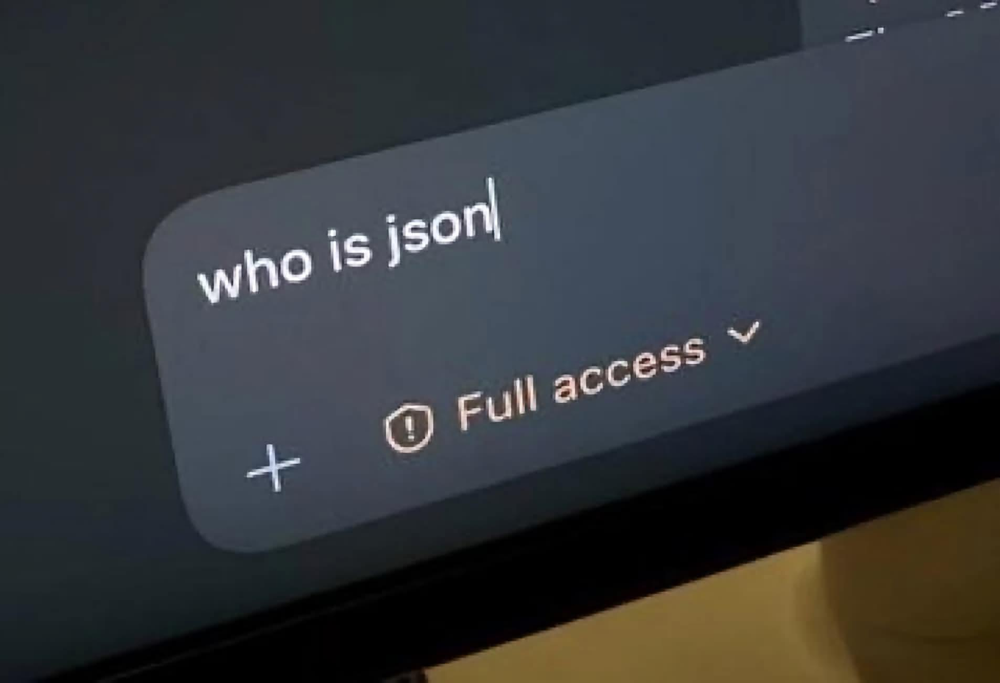

# 2026 年，我對 AI 熱潮的一些不適感

我先戴返個頭盔，我完全沒有在反對使用AI。事實上，我每天都在高強度使用 AI，甚至可以做到不到下午2點就用光ChatGPT Pro Max訂閱的兩個5小時limits。我從不否認它已經徹底改變世界，並且在很多場景裡真的非常有用，能有效提高生產力。

從最開始Copilot只能提示幾個代碼，到Cursor能夠一路Tab當太鼓達人打，到ChatGPT幫我揭穿前公司虛偽的低級謊言，再到後面Claude Code的出現徹底讓Vibe Coding不再是笑話。到現在Codex讓我們之前想做的Agentic Browser徹底變成笑話。

> 有人會問我上一次手寫code是什麼時候，你們可能在期待我說一年前，但是實際上是前天。我剛去手寫了幾個scripts從而提高某些 skills 的成功率。

AI的發展已經快到你無法預測半年以後AI的能力，但也正因為它真的有用，我才越來越反感現在AI Bro帶起的一些風氣。很多討論已經不是在問「這個工具能不能解決問題」，而是在問「你有沒有用 AI」「你是不是足夠 AI native」「你站哪家公司」「你相信哪個模型」。這種氣氛讓我很不舒服。

> 這篇文章不是什麼 AI 行業分析。我也沒有強到能夠站在很高的位置評論整個產業，我也不會像前公司CTO一樣覺得自己能比專業的更專業。這只是我作為一個普通工程師和 AI 使用者，在 2026 年對 AI 熱潮的一些觀察和不適感。

## Token 不是生產力

我覺得這兩年最荒謬的事情就是是很多公司對 AI 的態度變化之快。一開始，公司認為token比人便宜，都在鼓勵員工多用 AI，想要把一切都AI化，彷彿 token 燒得越多，甚至出現有公司直接用token來決定員工的KPI，然後隨者模型越來越貴，Codex/Claude Code 在功能越強，Token消耗越來越高，公司年底一看bills，token遠比人工要貴，bills已經高到會影響財報了，然後突然又開始限制員工使用AI工具了。

這件事本身並不奇怪。
- 模型廠商要賣token，他們不在乎token的使用效率
- Agent廠商要轉賣token，他們更樂見員工燒更多的token
- 因為AI，公司給員工更緊的工期，然後人類的天性又是偷懶，員工更不可能在乎token的使用效率了

知道公司意識到bills已經變成天文數字之前，提高Token使用效率並不合他們的利益。

這讓我想到以前一些公司喜歡用程式碼行數判斷工程師產出。程式碼行數當然可以被量化，而且非常容易統計。但問題是，一個工程師寫了一千行垃圾程式碼，和另一個工程師刪掉五百行無用代碼，哪個人貢獻更大？如果只看數字，答案可能是前者；如果真的看工程結果，答案很可能是後者。（更別說我可是曾經帶過團隊修改code format rule把團隊平均每週代碼行數翻倍來對公司用行數定KPI豎中指的黑歷史）

token 也是一樣。一個人燒了很多 token，不代表他產出了很多價值。一個人很少用 AI，也不代表他不擁抱工具。真正的問題是，現實世界裡每個人的付出、判斷和結果很難被簡單量化。公司因為恐懼選擇了錯誤的量化方式，最後就會製造出新的表演。

從2024年的Cursor開始，軟體工程師的coding效率成倍提升，隨著模型和Agent的能力的螺旋上升，你現在可能一天就能做完以前一個月才能完成的demo。越是業餘的人越容易被這種效率的提升給impressed到，與此同時比較Senior的SDE反而往往會嗤之以鼻，因為只要稍微有經驗的developer都會認同，Software Development不只有coding，越是Senior的developer的coding時間就會越少，純coding的提升對於他們來說，自然沒有那麼impressed。同時正如我的用詞：Demo，LLM確實集合了人類大量的歷史project，所以能夠快速做出一些能夠做Demo的網頁或者App，但是如果真的要長期維護這個project，很快你就會發現最後LLM的極限，然後意識到最後維護project的還是“人“。就比如說Vercel V0，現在還有人care這個產品嗎？ 

> 一個思考：一個官僚主義很嚴重的國家，如果你要辦一件事可能需要10個審批，AI讓這十個審批的速度大幅度提神之後，這個官僚系統還能被稱作官僚主義嗎？

同樣一個需求，你第一次做可能需要一天，第十次做可能只要3個小時，第一百次做可能可以speedrun到2小時，第一萬次做你可能都還需要1.5小時來做這個需求。任何事情都有他的極限，任何效率的提升都會有他的邊際效應遞減的問題，你現在把coding的速度提升10倍，那麼代價是什麼？ 

人月神話

## FOMO 讓工具變成表演

我非常反感一切的FOMO風氣。

很多討論給人的感覺是，任何事情不上 AI 就是不夠先進。整理文件要 AI，自動回信要 AI，安排日程要 AI，做飯買菜也要想辦法塞一個 agent。好像只要一件事情還是手動完成，就代表你還停留在舊時代。

問題是，很多 chore 根本不值得被自動化。

如果一件事情手動做只要三分鐘，但你花了一個下午寫 prompt、調 workflow、修腳本、處理 edge case，最後還要每次檢查 AI 有沒有搞錯，那這件事到底是提高效率，還是只是滿足了「我也用 AI 自動化了」的心理需求？

更不用說很多 AI 自動化本身不是免費的。它有 token 成本，有維護成本，有理解成本，也有錯誤成本。當這些成本加起來遠高於它節省的時間時，所謂自動化就不再是效率，而是一種表演。

我不是說不要自動化。工程師當然應該懶，能少做重複工作就少做。但懶也應該有計算。真正好的自動化，是把一個反覆出現、成本明確、錯誤率可控的流程變便宜，而不是為了證明自己 AI native，把每個日常動作都塞進模型裡。

## 模型和公司不值得崇拜

另一個讓我不舒服的地方，是很多人對 AI 公司和模型的態度越來越像站隊。

有人因為討厭 Anthropic，就無腦支持 OpenAI。也有人因為喜歡某家公司，就把某個模型神化成未來的唯一答案。每次新模型發布，社群就像在等神諭。Benchmark 高一點，大家開始宣布世界又被改寫；某個 demo 看起來很強，就開始說某些職業要立刻消失。

我覺得這和 AI FOMO 本質上是一回事。

它不是在討論工具，而是在尋找信仰。它不是在問「這個模型適不適合我的問題」，而是在問「哪家公司代表未來」。可是對普通使用者和工程師來說，這種問題大部分時候都沒有意義。

模型就是工具。工具有成本，有邊界，有適用場景，也有很煩人的失敗模式。今天某個模型寫代碼更強，明天另一個模型理解長上下文更好，後天又有新的價格策略和 API 限制。把工具當工具用就好了，沒有必要把它變成陣營。

我更願意關心的是：它能不能穩定解決我的問題？它的成本是不是合理？它錯的時候我能不能發現？它是否讓整個流程變簡單，而不是讓我多維護一層幻想？

## AI 會吃掉腦力勞動裡的體力勞動

我並不認為 AI 什麼都取代不了。相反，我覺得它一定會取代很多東西。

只是它最先取代的，未必是大家想像中那些最有創造力、最需要判斷力的部分。它更可能先吃掉腦力勞動裡的體力勞動。

很多看起來像腦力勞動的工作，其實有大量重複、機械、低判斷成本的部分。比如整理格式、搬運資訊、生成樣板、根據既有規則改一些代碼、把一段邏輯翻譯成另一種語法。這些事情以前需要人花時間做，是因為機器還不夠便宜，也不夠方便。現在模型能做，這些工作自然會被壓縮。

SDE 之所以會被影響，也和這件事有關。

寫代碼的試錯成本相對低。很多錯誤重新 compile、重新跑 test、重新看 error message 就可以繼續修。相比法律、醫療、金融這類錯誤成本非常高的場景，軟體工程裡有相當多部分更適合被模型反覆嘗試。

所以我不覺得「AI 會不會取代工程師」是一個好問題。更好的問題可能是：工程師工作裡哪些部分其實只是腦力勞動裡的體力活？這些部分消失之後，剩下的能力到底是什麼？

## 創造力不是下一個 token

但我仍然不相信人類的創造力可以被簡單地理解成下一個 token 的概率分布。

AI 可以模仿風格，可以拼接語料，可以生成非常像那麼回事的內容。它甚至可以在很多場景裡生成比普通人更工整、更完整、更像標準答案的東西。可是創造力不只是產生一個看起來合理的結果。

創造力還包括你為什麼想說這句話，你為什麼在這個時候說，你願意為哪個不成熟的想法冒風險，你願意忍受多少不被理解的時間。很多作品真正打動人的地方，不是它在形式上多完美，而是你能感覺到背後有一個人在做選擇。

這裡我想引用《一拳超人》和《路人超能 100》的作者 ONE 關於創作的原話，但我不想憑記憶硬寫。這段之後需要再核對來源和原文。暫時我想表達的是：創作不只是技術熟練度，也不是把所有流行元素加總。人想表達、想被看見、想把某種只有自己在意的東西做出來，這件事本身就不是一個純概率問題。

AI 可以降低表達的技術門檻，這很好。它可以幫不會畫圖的人做視覺草稿，幫不擅長寫作的人整理語言，幫不熟悉編程的人搭出 prototype。可是降低門檻不等於取代表達欲本身。

工具可以越來越強，但工具不會替你決定你到底想要什麼。

## 結尾：把 AI 放回工具的位置

所以我現在對 AI 的態度其實很簡單。

我會繼續用它，因為它真的有用。我也相信它會改變很多工作，讓很多重複、機械、低價值的部分消失。腦力勞動裡的體力勞動注定會被壓縮，這不是什麼壞事。

但我不想把 AI 當信仰，也不想把 token 消耗當生產力，更不想因為討厭某家公司就無腦支持另一家公司。

AI 至少到目前為止，仍然是一個昂貴的工具。工具應該被計算、被比較、被懷疑、被放在具體問題裡使用。當它真的能讓事情變簡單，就用；當它只是讓人覺得自己沒有落後，就停下來想一下。

我對 AI 最大的不適感，可能不是來自 AI 本身，而是來自人類面對新工具時那種熟悉的焦慮：害怕落後，害怕被淘汰，害怕自己沒有站在未來那一邊。

可是真正值得保留的東西，從來不是站在哪一邊，而是你能不能判斷什麼問題值得解決，什麼成本值得付出，以及什麼東西不應該被簡化成一個漂亮的數字。
