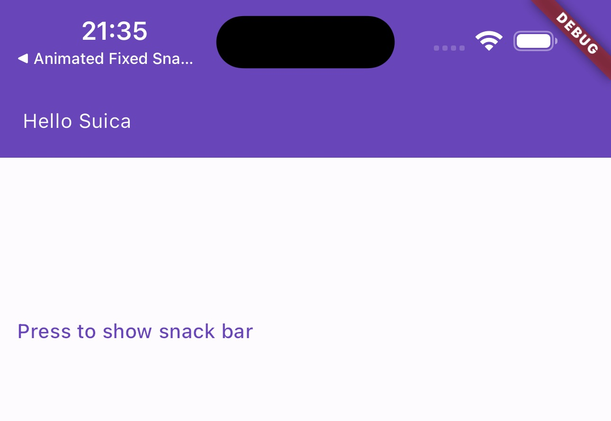

# An OT caused by Flutter Snack Bar

Recently, I received a requirement that implement a new toast that fixed the status bar on top. I thought it was pretty easy that I could just call the show snack `showSnackBar` and set the `behavior` to `floating` then set the margin to let it float on the top of the screen.

<!--  -->


```Dart
 ScaffoldMessenger.of(context).showSnackBar(
    SnackBar(
        behavior: SnackBarBehavior.floating,
        padding: EdgeInsets.zero,
        margin: EdgeInsets.only(
        bottom: MediaQuery.of(context).size.height -
            MediaQuery.of(context).padding.top -
            MediaQuery.of(context).padding.bottom -
            32,
        ),
        backgroundColor:
            Theme.of(context).colorScheme.primary,
        content: Container(
            margin: EdgeInsets.only(
                top: MediaQuery.of(context).padding.top),
            height: 32,
            padding: const EdgeInsets.all(8),
            color: Theme.of(context).colorScheme.error,
            child: Text(
            'Hello Suica',
            style: Theme.of(context)
                .textTheme
                .labelMedium
                ?.copyWith(
                    color: Theme.of(context)
                        .colorScheme
                        .onPrimary),
            ),
        ),
    ),
);
```

やばい

I realized that this requirement is not that easy to develop, because the display animation is always from bottom to top, and the requirement needs me to make it from top to bottom to fix the intuition.

Based on the document of [SnackBar](https://api.flutter.dev/flutter/material/SnackBar-class.html), there is a parameter called animation that I can customize its behavior.

```Dart
    @override
    void initState() {
    super.initState();

    _animationController =
        AnimationController(vsync: this, duration: const Duration(seconds: 3));
    _animation =
        CurvedAnimation(parent: _animationController, curve: Curves.easeInOut);
    }

    @override
    void dispose() {
    _animationController.dispose();
    super.dispose();
    }
    ...
    ScaffoldMessenger.of(context).showSnackBar(
        SnackBar(
            behavior: SnackBarBehavior.floating,
            padding: EdgeInsets.zero,
            margin: EdgeInsets.only(
            bottom: MediaQuery.of(context).size.height -
                MediaQuery.of(context).padding.top -
                MediaQuery.of(context).padding.bottom -
                32,
            ),
            backgroundColor:
                Theme.of(context).colorScheme.primary,
            animation: _animation
            content: Container(
                margin: EdgeInsets.only(
                    top: MediaQuery.of(context).padding.top),
                height: 32,
                padding: const EdgeInsets.all(8),
                color: Theme.of(context).colorScheme.error,
                child: Text(
                'Hello Suica',
                style: Theme.of(context)
                    .textTheme
                    .labelMedium
                    ?.copyWith(
                        color: Theme.of(context)
                            .colorScheme
                            .onPrimary),
                ),
            ),
        ),
    );
```

The problem seems to be fixed and I don't need to work overtime, great!

It is not that easy, the animation does not affect the snack bar at all. Not only the behavior but the duration. What happened?
After half an hour of research, I found the problem, it is in the `showSnackBar` methods source code. It will always create a new `animationController` to replace the `controller` you set in `SnackBar`.


しまった

This problem is pretty easy to fix, just added a new parameter with a couple of lines of code. I opened an [issue](https://github.com/flutter/flutter/issues/141646) and provided the solution. Although it already caused OT, I was very happy that I finally had the motivation to join one of the 5000 (Open Issues). I received a comment the next morning and the ticket was closed due to duplicate. I am not very happy about the result because those two old issues are only mentioned and try to solve the problem relative to material 3, while my ticket talks about the design of the snack bar animation design. After some useless discussion on the Discord channel. I thought that it was very inefficient to wait for the new version of Flutter, as this problem has existed for years. Especially It already caused OT, so I decided to implement a replacement of default `SnackBar`.