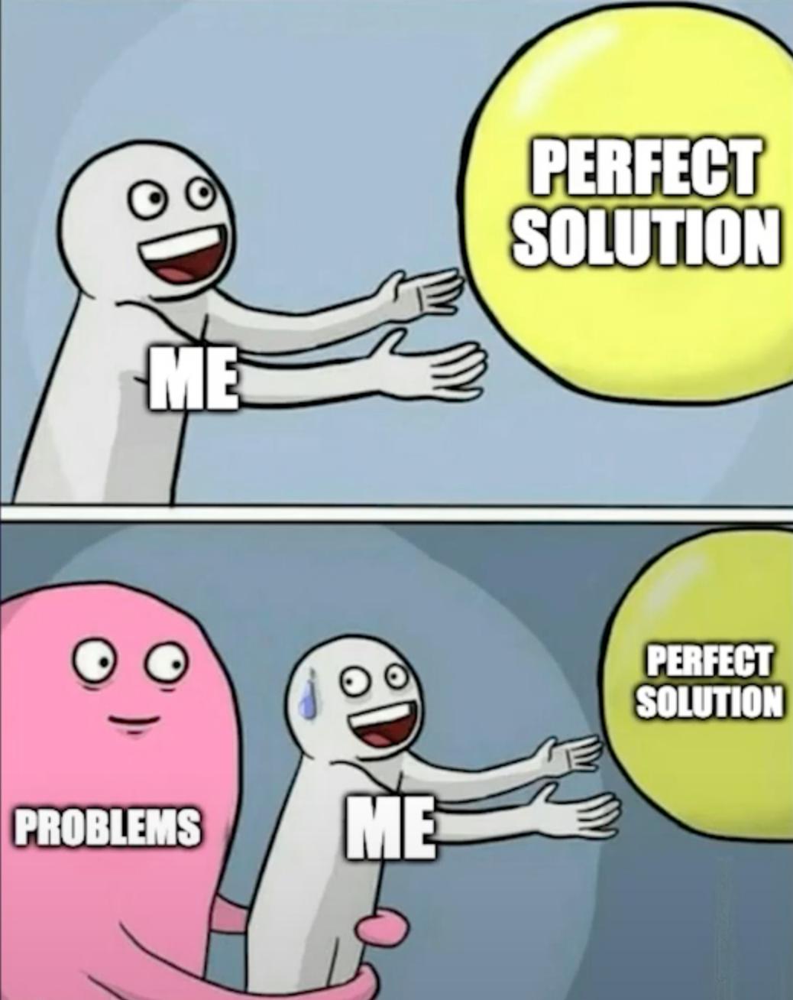

# 前端 project 怎麼處理環境變數？談談我這邊的做法

其實我一直都有點不太想碰這個話題，因為這個問題太基礎又有點太廣了，我一直沒有自信能講好這個話題，不過因為一些眾所週知的事情，我覺得還是至少分享下我的一些觀點，以及跟朋友們討論之後的一些心得。

無論前後端，環境變數(環境變量，Environment Variable)都是一個非常重要的概念，他可以用來給你的程式提供一些 context，比如說你正在開發的環境還是生產環境，或者說你正在開發的環境是本地還是遠端，或者說你正在部署的後端 URL，一些 SaaS 的 key，這些都是環境變數可以幫助你解決的問題。然後這個問題之所以難講，是因為不同的專案可能有不同的最佳做法，甚至根本不存在所謂的 the best practice。我親眼見過兩個 Senior Frontend Developer 因為這個問題吵起來。而且還有一點，你必須要深刻理解這個 project ，才能夠知道什麼是合適的 practice。

## 一些基礎知識

無論你是用什麼語言，什麼框架，什麼工具，前端或者後端，你都必須要理解環境變數的概念，以及如何使用環境變數。

### .env

通常你至少會有一個`.env` 檔案，這個檔案通常會放在你的 project 的根目錄，這個檔案通常會包含一些環境變數，比如說你正在開發的環境還是生產環境，或者說你正在開發的環境是本地還是遠端，或者說你正在部署的後端 URL，一些 SaaS (Software-as-a-Service) 的 key，這些都是環境變數可能可以幫助你解決的問題。

#### 如何使用 .env

首先在你的根目錄建立一個`.env` 檔案

```bash
# .env
API_URL=https://api.example.com
```

然後在你的 TypeScript code 可以這樣使用

```TypeScript
const apiUrl = process.env.API_URL
```

不過如果你熟悉 TypeScript, 去查看 `apiUrl` 的 type 會是 `string | undefined`，這是因為你沒辦法保證這個環境變數一定會存在，所以你必須要考慮到這個情況。然後這個就出現了第一個爭議點：是否需要給環境變數一個 defaultValue？

```TypeScript
const apiUrl = process.env.API_URL || 'http://localhost:8000'
```

> Vite 的 `import.meta.env.VITE_API_URL` type 是 `string`，但我先不想評論，怕模糊焦點

讓我在這裡先買個關子，這個問題的答案是：不一定，然後我會在後面解釋。

#### .env 的種類

除了`.env` 之外，我們經常還需要其他一些`.env` 變體，從而讓前端可以方便地訪問不同環境的後端 URL，從而模擬復現不同環境的問題。

通常我們還會有

```
# dev mode/測試環境，然後你也可以按你的需求來決定怎麼處理qa環境
.env.development
# 生產環境/正式環境
.env.production
# 測試環境
.env.test
# 本地環境
.env.local

# 你也可以額外定義
.env.development.local
# 或者自訂環境
.env.dev
.env.qa
```

同時，我們一般還會維護一個叫.env.example 的檔案，這個檔案作為一個 document 會包含所有可能的環境變數，從而讓開發者可以方便地知道哪些環境變數是可用的，以及他們的用途。然後你應該 commit 這個檔案，並且保證其他.env 檔案不在任何 Git History 中。

### 環境變數的種類

正如前文所說，.env 能做的事情很多，所以所存放的環境變數自然也有不同的類型，我們可以分為以下幾種：

1. 真·環境變數：後端 URL，當前所運行的環境（於後端同步）

2. 配置變數：比如說一些功能開關或者全局靜態可設定參數之類的

3. 敏感變數：比如說一些 API key，或者一些敏感的資料

1 和 2 其實可以合併起來，完全取決於你的需求。總的來說就兩個大分類：能給用戶看的和不能給用戶看的。

### 前端和後端對於環境變數處理的區別

這是一個非常簡單的邏輯，但凡你有一點全棧經驗，你都會知道前端和後端完全是兩個完全不同的世界，從關注的點到思考的邏輯都完全不同，妄圖用一套方案解決兩個完全不同的問題，只會讓你陷入無盡的痛苦。

我這裡只舉兩個例子

1. 前端通常不存真正的 secret，而後端要考慮怎麼獲取這些 secret
2. 前端還會在 build 上區分 dev/test/prod，而後端則不一定，取決於語言

#### 前端通常不存真正的 secret，而後端要考慮怎麼獲取這些 secret

通常只有真正的`**`才會把真正的 secret 放在前端，因為這些變數都會被發送到前端，理論上用戶都是可以訪問到的。因此一些第三方 SaaS 的架構比如 Clerk 或者 Sentry 給前端的都是 public key，然後髒活累活都交給後端來做。因此後端需要操心怎麼處理這些 secret，而前端則基本不用考慮。

> 後端怎麼管理 secret 不在本文討論範圍 😈 我就不寫了 你們愛用什麼 secret management 就用哪家

然後隨著你的後端代碼增長，或者你接入更多的第三方 APIs，你的.env 檔案必然會越來越大，最後你會發現你的.env 檔案變得非常難以管理，於此同時前端的.env 檔案就跟我的錢包一樣空空如也。甚至有些前端架構直接完全不用.env 了。

> 有個反例是，如果你在用 Flutter，或者進行 App 開發，你是會需要管理一些非環境變數 secret 的，比如說 keystore，不過本文前端只指那種會跑在瀏覽器上的 😡。 誰提 Flutter Web 就丟進泰晤士河喂鰻魚。

#### 前端還會在 build 上區分 dev/test/prod，而後端則不一定，取決於語言

無論是 Flutter 還是任意一個 JavaScript Library，因為要渲染 UI 並且減少到用戶手裡的 bundle size，通常都會有不同的方式來 build。

> Flutter 甚至還要再多一個 profile mode，介於 dev 和 release 中間

而後端則完全取決於語言，比如說 Go 就是有區分的例子，而 Python 就是沒有的例子

因此 JavaScript 一個特別的環境變數 `NODE_ENV`，這個變數會在 build 的時候被設置，從而讓前端知道當前是 dev/test/prod 環境。然後`NODE_ENV`理論上是可以手動 override，不過如今大部分 framework 已經在黑箱裡面提前幫你 override 了。

> 如果你把 `NODE_ENV` 當成一個表達雲端環境的變數，我覺得你可以不用寫前端了，我是認真的。

## 為什麼不存在 The best practice

我其實一直很反感 the best practice 這個詞，因為這個詞背後隱含的意義是：存在一個唯一且正確的答案。工程師們對於任何一個領域的理解是螺旋上升的，每年你的領域都可能會有不同的`META`. 今年因為現有技術得出的最佳實踐，明年新的技術出來可能你的方案就過時了。因此我一直會使用 Good practice 來代替 the best practice，只要能解決問題的 practice 就是好的 practice。



然後在環境變數的處理在面對不同的需求，也會需要面對不同的問題，我這裡舉幾個例子

1. Micro Frontend

在微前端架構中，你面對的主要問題將會是怎麼管理不同子應用之間的環境變數同步，繼承和覆蓋。稍微思考一下加減一個環境變數要對 CI/CD 進行的改動，估計沒有人不會頭疼，然後稍微不注意，某些地方就忘記配置可能就傳了一個空變數進 App，因此你可能需要引入額外的庫來幫助你管理這些環境變數，同時你也需要考慮忘記同步的風險，從而對獲取的環境變數進行額外的驗證可以說成為了必須。

2. 當你不想切換環境的時候需要重新 build 你的 project，而是 build one deploy everywhere

如果你有移動端開發的經驗，那麼你就會對這感到非常熟悉，為了避免頻繁 build 的耗時，直接把某幾個環境的環境變數打包到你的 App 裡面，從而讓 App 獲得動態切換環境的能力。通常是在登錄頁面提供一個環境變數，然後在測試的時候可以在登錄頁面選擇登錄哪一個環境。這種情況你可能就會直接把部分環境變數直接 hardcode 到你的 app 裡面或者同時 import 多個.env 檔案，同時在 build production 的時候再把這些 code tree shaking 掉。

3. 如果你同時有多個後端 domain，你需要動態切換後端的 domain

先說明我當然是知道什麼是 CDN，不過如果在亞洲工作過的估計都知道在某些行業會採取這種措施來減少某些風險：首先請求一個 API 獲取其他 APIs 的 domain 然後再 setup 整個 project 的 basic domain。這個方案其實在歐美同樣的行業也非常常見，甚至某些熱門行業直接有個一整個標準就是基於這個方案。在這種情況下，你的環境變數很大一部分都會由某個後端 APIs 來分發。然後關於 App 的一些 configuration，你也可以完全交由後端來管理，比如說 App 的一些 Theme，或者 White label 之類的配置。

## 倫敦鵝的建議

說了一大段廢話我相信不同再多說解釋不同需求下有不同的 solution 了。我接下來打算總結一下我的一些觀點，以及我的一些做法。

### 讓你的 App 的環境變數管理一開始盡可能簡單，別浪費太多時間在這

首先很殘酷的一點是，你沒辦法精神控制你的 PM ，你也沒辦法控制整個 project 的發展路線，大部分時候你開啟一個新的前端 project 的時候，後端往往也會是新的 project，因此你的 project 除了要考慮前端的工程化進度，同時也要考慮後端的變化。因此我會建議讓你的 project 的環境變數管理一開始就盡可能簡單，從而讓你後續的改動的成本盡可能低。

其次，`.env` 檔案這種東西，只在你本地跑 `npm run dev` 的時候有意義。一旦上了 Cloud ，環境變數都是別的系統幫你注進去的，根本不會去讀你那些 .env.prod 或 .env.qa。所以真的別浪費太多時間糾結要拆幾個 `.env`，一開始把事情弄簡單，之後才好改。

> 倫敦鵝的暴論：一個能在公司配的文書筆電上用 Docker Compose 跑起來的 full stack 專案，真的就別當自己大 Project。

### 讓你環境變數變成真正的 constant

雖然眾所週知, JavaScript 的 const 是假的，你還是被允許修改 constant 裡面 reference 的值（除非你手動 freeze），不過在 TypeScript 裡面一些 feature 可以幫我們一定程度上解決這個問題。

```TypeScript
// env.ts
const env = {
  API_URL: process.env.API_URL,
} as const
```

我們可以通過`as const`來強制讓裡面的 properties 全都變成 readonly，從而讓你無法修改裡面的值。

### 在 Full Stack project 中把你的 server 環境變數和 client 環境變數分開寫，然後用你的 Eslint 狠狠限制 client component 不能 import server env

一個沒有提的前端趨勢是，以 Vite 為首的大部分前端工具都開始定義自己的`.env` properties prefix, 比如說當你在使用 Vite 的時候，你必須要加上`VITE_`前綴才能讓前端讀取到環境變數，而在 Next.js 中你必須要有`NEXT_PUBLIC_`前綴才能讓前端讀取。雖然 framework 底層已經做了前後端分離的安全措施，但是我還是會推薦無論你在任何情況都把分開存放，並且你最好做好防護，配置好合適的 Eslint 規則。

```TypeScript
// env.client.ts
const clientEnv = {
  API_URL: process.env.NEXT_PUBLIC_API_URL,
} as const
```

```TypeScript
// env.server.ts
const serverEnv = {
  SECRET_KEY: process.env.SECRET_KEY,
} as const
```

然後這裡還有一個傳說級別大坑，我覺得有必要提一下

#### 前端神奇的環境變數緩存

如果你經常碰一些前端的 infra，你估計會笑出聲，無論你是用`Vite`還是`Next.js`，你時不時都會遇到這樣的問題，你修改的環境變數，但是無論怎麼重啟 server 或者清空 project 裡面的`build/.next` 和 `node_modules`，你都會發現你的環境變數沒有變化，依舊只能獲取到舊的值。而且這個問題發病症狀還有所不同，有些人重新 clone project 就解決了，有些什麼都不做第二天自己就好了。很慚愧這個問題我也沒有找到一個完美的解決方案，也是只能和大家一樣一步步嘗試。

### 如果你需要驗證環境變數的話，請優先使用你正在使用的 framework 的驗證方式

沒有人會反對環境變數需要被驗證，這一切都是要到你真的有這個需求的情況下。如果你剛開始一個 project, 只有一個`API_URL`一個環境變數，然後這個 URL 基本不可能變化，那麼你真的有必要為了這一個環境變數從一開始就引入全套驗證邏輯嗎？說句不好聽的，如果真的因為只有一個`API_URL`環境變數的情況下，你的代碼能上 production 然後在 production 因為忘記傳環境變數掛掉，最應該檢討的是整個開發流程或者 CI/CD 而不是代碼。等你的環境變數多了起來，CI/CD 越來越複雜，同事數量也變多起來，這個時候管理環境變數才會真正變成一個問題，你應該花時間去思考如何管理他。

我個人是非常反對前端引入像是[Envalid](https://www.npmjs.com/package/envalid)這種庫，因為這個庫的設計初衷只是為了做驗證環境變數。雖然對於一個庫來說，專注於一個事情是好事，但是對前端這種每 1kb 的 bundle size 都很重要的領域來說，這個庫的 CP 值似乎有點太低了。我不否認在一些後端 Node.js 場景，這個庫也許有他的價值，但是對於大部分前端場景來說，導入這個庫恐怕真的不如你手寫驗證 function 有 CP 值。

要特別感謝`Bryan Lee`大大的建議，我們應該用一些更優雅的方式驗證環境變數。尤其是在你已經用了`zod`或者餓`yup`這種驗證庫的情況下，你完全可以直接用他們的 API 來驗證環境變數。

```TypeScript
import { z } from 'zod'

const envSchema = z.object({
  API_URL: z.string().url(),
})

// 千萬不要在Next.js裡面這麼做
const env = envSchema.parse(process.env)
```

然後你也可以使用更多的`zod`的 API 來進行額外的驗證，你是自由的。


不過這種方式在`Next.js`裡面有另一個傳說級別大坑：你沒辦法動態從`process.env`裡面獲取變數

參考這個[回答](https://stackoverflow.com/a/66626413)，這又是一個 Next.js 的黑魔法，如果你不在 build time 就先取得環境變數，那麼在 client-side 執行時 process.env 會是空的 {}，因為 Webpack 在編譯階段已經靜態替換掉它了。

```TypeScript
import { z } from 'zod'

const envSchema = z.object({
  API_URL: z.string().url(),
})

const env = envSchema.parse({
  API_URL: process.env.NEXT_PUBLIC_API_URL,
})
```

如果在後端，動態獲取`.env`的時候，你也可以這樣手動驗證，然後`process.exit(1)`，然後扭送 Sentry。

### 如果你只有非 secret 環境變數，那麼可以考慮給你的環境變數設置一個 default value

我們終於要來說這一個大爭議點了，然後這也是第一個點`盡可能簡單`的 callback。儘管前端遠不需要像後端一樣管理非常多的環境變數，但是對於環境的管理這一點是共通的。首先我們先定義一個共識。

我們現在先假設後端一共會部署四個環境，分別是`dev`, `qa`, `uat`, `prod`。然後前端也需要準備指向同樣的四個環境，分別是`dev`, `qa`, `uat`, `prod`。

也就是我們會有四個`.env`檔案對應四個環境，再加上如果你的前後端是分開的，你有時候還需要在本地跑起這個後端 project，你還需要一個`.env.local`檔案去訪問這個後端。

所以這是我們自訂環境的環境變數檔案

```
.env.dev
.env.qa
.env.uat
.env.prod
```

作為對比，這裡是傳統的方式的環境變數檔案

```
.env.example
.env.local
.env.test
.env.development
.env.production
```

你會注意到這裡同時存在`.env.dev`和`.env.development`，這涉及到一些前端和後端開發的不同，以及 JavaScript 和 Software Engineering 裡兩個`環境`定義的差異，讓我們先關注這樣子定義的問題。

#### 通過設置 default value 來減少一個要維護的`.env`檔案

前端因為工具太多太雜的關係，root level 下會有很多亂七八糟的 config files，我之前工作過的一家公司的一個 project 在 project root 下跑`ls -1 | wc -l`差一點就輸出了三位數。

> 這也是其中一個原因為什麼前端都喜歡把 source code 全部塞到某個 folder 裡面，比如說`src`，從而與配置隔離。

而隨著環境增加的`.env`檔案自然會加劇這個現象，並且更多的環境變數也會增加你在`package.json`裡面要寫的`scripts` alias 的數量。於此同時，你在本地開發的時候，99%的情況都只會碰`.env.local`，`.env.dev`和`.env.qa`這三個檔案，其中`.env.local`裡面的變數更是完全不會上 CI/CD，並且因為變數指向本地，也沒有不能上傳到 Git 的顧慮，但是如果上傳`.env.local`到 Git，似乎又跟`.env.example`有些重複，因此`.env.local`似乎出現了一些存在主義危機。

我待過的幾乎每個團隊都經歷過這樣這個問題，並且有產生了不同的解決方案：

1. 直接刪除`.env.local`然後在本地開發的時候直接使用`.env.example`，並且`.env.example`會被上傳到 Git.

2. 直接刪除整個`.env.local`，然後在代碼裡面把 local variables 作為 default value

然後我這裡要推的就是第二種方案的變種，與其另外維護 .env.local，不如一開始就把這些變數的預設值寫在程式碼裡，讓專案更簡潔易懂。

```TypeScript
// env.ts
const env = {
  API_URL: process.env.API_URL || 'http://localhost:3000',
} as const
```

這樣做的好處是，你最開始保證了你的環境變數盡可能簡單，你不用再維護一個額外的環境，尤其是你根本沒有這麼多環境變數的情況下，然後因為你保證了配置的盡可能簡單，之後如果有額外的需求，你也可以盡可能簡單的修改你的代碼。

如果你要在本地開發的時候使用`dev`的後端, 你只要跑直接跑`pnpm run dev`，然後因為你有設置`dotenv -e .env.dev`，所以你只會讀到`.env.dev`的值，如果你要使用本地的後端，你只需要不給程式傳`.env`檔案就好了。

> 這裡用`dotenv-cli`做示例，你也可以用別的 library。

```bash
dotenv -e .env.dev vite
```

你也可以給每個環境都加上 alias

```json
"scripts": {
  // .env.empty 可以是完全空的檔案，你也可以用其他方式讓其為空，總結來說讓你的Runtime使用你設置的 defaultValue
  "dev": "dotenv -e .env.empty vite",
  "dev:dev": "dotenv -e .env.dev vite",
  "dev:qa": "dotenv -e .env.qa vite",
  "dev:uat": "dotenv -e .env.uat vite",
  "dev:prod": "dotenv -e .env.prod vite"
}
```

> 如果你是使用我們最愛的的`Next.js`，你還需要進行一些額外的配置，後文會提到

#### 請給每一個環境都設置一個 alias 定死你引用的環境變數檔案

這裡要補充一個 Context，無論是 `Vite` 還是 `Webpack`，在跑最普通的`npm run dev`的時候，只要是用`dotenv`來讀取`.env`檔案都有一個 fallback 機制。

一般來說優先級是這樣的

1. .env.{NODE_ENV}.local
2. .env.local
3. .env.{NODE_ENV}
4. .env

也就是說如果讀不到`.env.{ENV}.local`，就會讀取`.env.local`，然後一直往下找，直到讀到`.env`。這整個機制是有點反直覺的，尤其是`.env.local`的優先級處於`.env.{ENV}`和`.env.{ENV}.local`之間，我思考了五年了，都沒有想明白這個優先級為什麼是先排序 `local` 後排序 `env`。這都不重要，重點是這個 fallback 環境管理變得特別複雜，於此同時，整個 fallback 是基於`NODE_ENV`，正如前文所說，這不符合前端開發習慣，同時這種類似有點類似 JavaScript 的 Implicit Type Conversion，會增加案子上手的心智負擔。

然後另一個很抽象的是，在`Vite`中優先級又變成了先排序`env`然後才是`local`，雖然這讓整個優先級變得稍微合理了一些，但是也會對跨 project 維護變得苦難。

1. .env.{NODE_ENV}.local
2. .env.{NODE_ENV}
3. .env.local
4. .env

在我們最愛的`Next.js`中，你還需要手動改寫`next.config.js`，或者用自訂 script 去覆蓋`.env`，否則你會發現無論怎麼樣你都沒辦法拜託這個 fallback 機制。

```TypeScript
// /scripts/run-dev.ts
import dotenv from "dotenv";
dotenv.config({ path: ".env.dev" });

import { execSync } from "child_process";

execSync("next dev", { stdio: "inherit" });
```

```json
// package.json
"scripts": {
  "dev:dev": "tsx /scripts/run-dev.ts",
}
```

我特地問了身邊的前端工程師朋友，沒有一個人知道/記得這個 fallback 優先級，然後我在 Twitter 上開了一個投票，結果如下：


49 人中有 67% 的人不知道這個優先級，因此我覺得這可以算作一個大部分前端工程師都不知道的暗坑，所以我覺得我們應該想辦法迴避這個 conversion。

更關鍵的是 fallback 是基於`NODE_ENV`，而`NODE_ENV`指的是你的程式所執行的`mode`，因此就會出現一個很滑稽的情況：如果你嚴格按照上面標準來設置，當你跑`npm run dev`的時候，你完全沒辦法一眼看出`.env.local`、`.env.development`、`.env.development.local`哪一個指向你的 `local` 環境，因為`NODE_ENV`的值是基於你跑的`mode`，你不可能在 Server 跑`npm run dev`，因此部署之後永遠都指向 production，無論你部署的是什麼環境，而在本地測試的時候，99%的情況你都是跑在`dev mode`下，因此`.env.local`、`.env.development`對於前端幾乎可以寫上三個等號（`===`）。

當然這也要取決於你的團隊標準，如果你直接問 GPT 這個問題，GPT 會讓你把`.env.development`丟到 Git，本地開發的時候再用`.env.development.local`覆蓋，正如我前文所說，沒有 the best practice，只有最適合你的 practice。

#### 只保留不同環境的`.env`檔案，不使用任何基於`mode`的`.env`檔案 (除了測試)

這裡用意是避免引用兩套不同的環境變數從而給開發者們造成更多的混淆，你應該注意到了我一直用的都是`.env.dev`而不是`.env.development`，這裡是因為我想要避免任何對於原本基於`mode`的用法的重定義，從而造成非前端開發者對於專案的困惑，而`.env.test`是被保留的唯一一個基於`mode`的`.env`檔案，這是因為對於我接受的大部分專案這樣就足夠了，你可以根據你們團隊的需求對其進行 CRUD，正如我之前所說，沒有 the best practice，只有最適合你的 practice。

```

.env.dev
.env.qa
.env.uat
.env.prod
.env.test

```

#### 我的建議總結

總結來說，我的建議就是在你的項目的一開始，給每一個後端會有的環境配置好 alias，然後指定一個沒有 fallback 的`.env.[environment]`檔案，而不是使用`.env.[NODE_ENV]`檔案，然後再把全部`.env.local`裡面的變數全部設置成你讀取環境變數的時候的 default value。這樣你就可以少維護一個`.env`檔案，同時避免了各種 fallback 導致的混淆，並且你也獲得了很大的 flexible，如果團隊想要轉向 monorepo 或者 micro frontend，你也可以很輕鬆地進行修改。

如果你的團隊有別的方案，並且你們認為這是對的，那麼不要懷疑，這就是最合適你們的方案，對於大部分團隊來說，死磕這些問題其實沒有任何價值，尤其是在你的前端團隊少於 10 人的情況下，真正最重要的是團隊內溝通清楚，拿出一個團隊內部認可的解決方案，而不是一言堂，說這個技術就是 industry standard 所以我們就要無腦用。

> ~~其他還有不上傳 Git 的`.env`檔案要怎麼管理，團隊之間要怎麼共享這些，monorepo, micro frontend 要怎麼管理，以後我再找機會寫~~

## 後記

這篇文章拖了很久才完成，主要是因為生活中各種事情交織影響。最初動筆只是想把我所理解的內容分享出來，但寫著寫著，心境逐漸低落，對技術探索的熱情也一度陷入低谷。不過日子還是得過下去，畢竟 Coding 真的是一件讓人著迷的事。文章中肯定會有錯漏或觀點不盡周全，我也理解有些建議可能不符合每個人的想法。如果你有不同意見，歡迎在 Twitter 回覆，我非常期待與大家交流、彼此學習，一起打破同溫層的限制，畢竟這才是一個健康的溝通環境。
